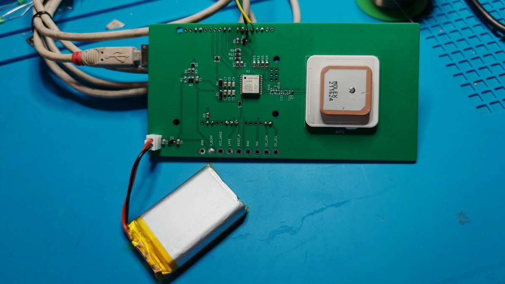
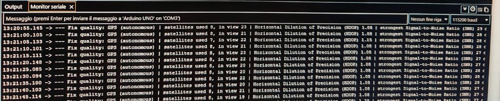
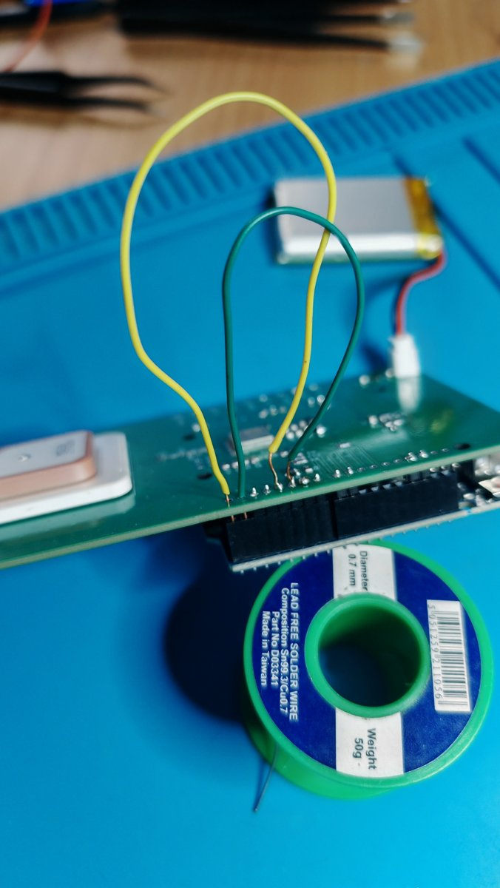
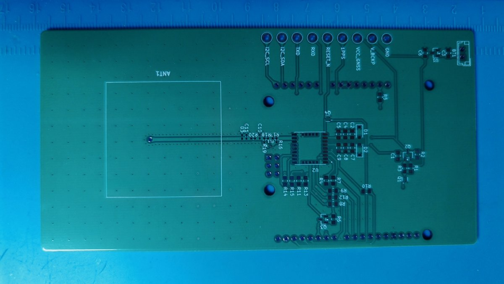
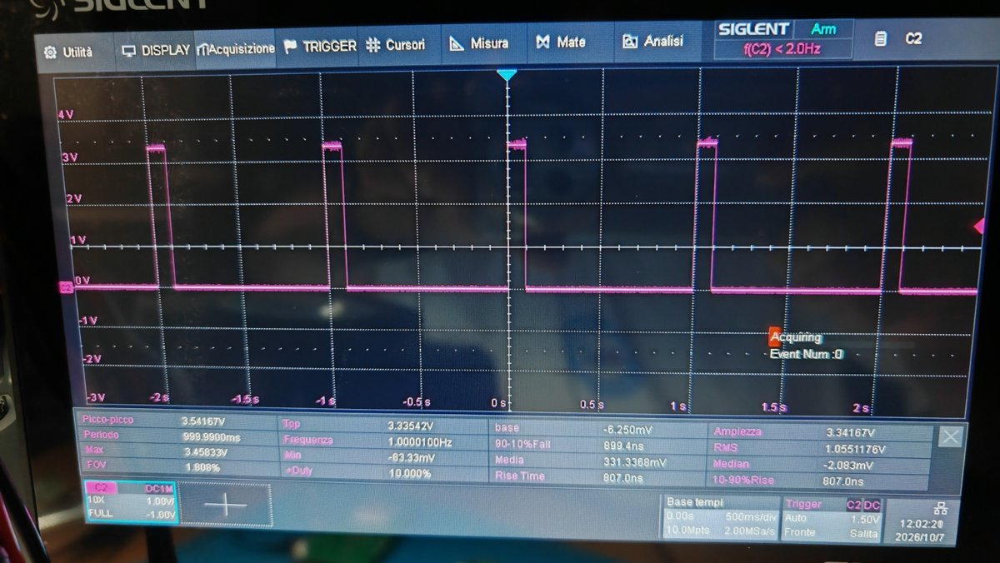

# Quectel_LC76G

Arduino library for the **Quectel LC76G** multi-constellation GNSS module
(GPS, GLONASS, Galileo, BeiDou, QZSS).



> **About the hardware.** The shield in the pictures is the **revision 1
> test prototype** used to develop and test this library: it is **not the
> final design**. An improved revision 2 will follow, fixing the issues
> listed in [Reference shield, revision 1 – known issues](#reference-shield-revision-1--known-issues).
> The library itself does not depend on this board: any LC76G wiring works.

> **Status: 1.0.0.** Every function was tested on the bench with real
> hardware (LC76G (PA) on Arduino Uno R3 and Uno R4 Minima), except the
> few listed under [Test status](#test-status), which need outdoor or
> laboratory tests.

## Features

- UART link through any Arduino `Stream` (`HardwareSerial` or `SoftwareSerial`)
- **I2C link** as an alternative to the UART (`LC76G_I2C`, header-only, used
  like a serial port: every function of the library works the same way)
- Automatic UART baud rate configuration: a brand-new module (115200 baud) is
  switched to the speed you choose, e.g. 38400 for `SoftwareSerial`
- NMEA decoder for **RMC**, **GGA** and **GSV**, integer-only
  (latitude/longitude in degrees × 10⁷, no float precision loss on AVR)
- Satellites in view per constellation and strongest signal (SNR)
- End-of-epoch callback, called once per second
- **PAIR** commands with automatic checksum, acknowledgement (`$PAIR001`)
  handling and query results
- Hot / warm / cold start, baud rate query and change
- NMEA output configuration: choose which sentences are sent and how often,
  or keep only the ones the decoder needs (about 30% less UART traffic with a fix)
- Save the configuration to the module flash
- Constellation selection (GPS, GLONASS, Galileo, BDS, QZSS), limited to
  the combinations supported by the LC76G
- Jamming detection: status messages decoded automatically, optional
  reading of the JAM_IND pin
- PQTM proprietary commands with OK/ERROR handling, PQTM message rates
  (set and read back)
- Output settings: minimum satellite SNR, NMEA decimal places and Talker
  ID, RTCM 3 output configuration (the binary RTCM data itself is not
  decoded), Galileo Return Link Message output, 1PPS / NMEA synchronisation
- PQTM output messages decoded through callbacks, integer-only:
  **PQTMPVT** (position, velocity and time), **PQTMVEL** (velocity with
  accuracy estimates), **PQTMDOP** (all dilution of precision values),
  **PQTMODO** (odometer, with configuration and reset), **PQTMTIMEGPS**
  (GPS week and time of week with accuracy), **PQTMPL** (protection
  levels), **PQTMPOSECEF / PQTMVELECEF / PQTMPVTECEF** (ECEF coordinates).
  A message that is not used costs no RAM and no flash
- Geofence: up to 4 circles or polygons, status messages decoded
  automatically, optional reading of the GEOFENCE pin
- 1PPS (One Pulse Per Second) configuration, and optional pulse measurement
  (count, period, width) on an Arduino interrupt pin
- Low power: navigation mode, ALP (Adaptive Low Power), GLP (GPS Low
  Power), FLP (Fitness Low Power), periodic run/sleep, Backup mode with
  automatic VCC cut and wake-up through the power and reset pins
- AGNSS (Assisted GNSS) without internet: EASY and EPOC orbit prediction,
  navigation data save/clear, reference time and position injection,
  firmware version query
- LOCUS built-in logger (128 KB): modes, thresholds, record count, read-back,
  automatic protection of the recorded data on reboot / power-off
- Reception settings: elevation mask, AIC (Active Interference
  Cancellation), SBAS / DGPS corrections, 2D fix, real-time speed response,
  BDS B1C band, static navigation threshold
- Estimated positioning error (PQTMEPE) in metres, factory reset and
  parameter save (PQTMRESTOREPAR / PQTMSAVEPAR)
- Readable full names for results, NMEA sentences and constellations
- Safe control of the module power and reset pins, with three drive modes
  for different hardware designs
- No dynamic memory, no `String` objects

## Supported boards

| Board | Status |
|---|---|
| Arduino Uno R3 (ATmega328P) | Tested (UART through SoftwareSerial, I2C) |
| Arduino Uno R4 Minima | Tested (UART through Serial1 on D0/D1, I2C); all examples select Serial1 automatically, see "Serial port on the Uno R4" |
| Arduino Uno R4 WiFi | Same core as the Minima, not tested |

On the Uno R3 the `BasicMonitor` example uses about 16.5 KB of flash and
1 KB of RAM (`I2cMonitor`: 18.8 KB and 1.15 KB). Unused features cost
nothing: the PQTM message decoders and the I2C port are linked only when
a sketch uses them.

## Compatible modules and limitations

The library uses the commands of the Quectel *LC26G & LC26G-T & LC76G &
LC86G Series GNSS Protocol Specification* (v1.5), shared by this family:

| Series | Variants covered by the protocol |
|---|---|
| LC26G | LC26G (AB) |
| LC26G-T | LC26G-T (AA) |
| LC76G | LC76G (AB), LC76G (PA), LC76G (PB) |
| LC86G | LC86G (AA), LC86G (AB), LC86G (LA), LC86G (PA) |

**Tested on real hardware: LC76G (PA) only**, firmware
`LC76GPANR12A06S`. The other variants should work for the common
commands, but are not tested.

Known differences between the variants, from the Quectel documentation:

- **Supply and I/O voltage.** LC76G (AB, PA): VCC 2.55–3.6 V, I/O at VCC
  (3.3 V typ.). **LC76G (PB): VCC 1.75–1.98 V, I/O at 1.8 V**, absolute
  maximum 1.98 V on the I/O pins: it needs 1.8 V level shifting and is not
  compatible with the reference shield.
- **Constellations.** LC86G (AA) has no GLONASS and LC86G (AB) has no BDS;
  their accepted search-mode combinations differ from the other variants.
  `setConstellations()` checks the combinations of the LC76G series and may
  refuse valid LC86G (AA/AB) combinations, or accept ones they do not have.
- **Low power modes.** LC26G-T (AA) does not support ALP, FLP and the
  periodic mode (protocol specification). ALP needs a minimum firmware
  version (e.g. LC76G (PA) `LC76GPANR02A02S` or later, Low Power Mode
  Application Note). The Low Power Mode Application Note does not cover
  LC26G-T (AA).
- **Not implemented on purpose.** QZSS SLAS (PAIR420/421, PQTMCFGSLAS,
  PQTMSLAS: sub-metre corrections available only in Japan, partly binary
  output), the binary debug log (PAIR086, needs 921600 baud), PQTMCFGCNST
  (same function as PAIR066, already covered by `setConstellations()`),
  the timing modes PAIR753–765 (LC26G-T only) and the fix rate PAIR050
  (LC76G (PA/PB) are fixed at 1 Hz).
- **PQTM messages and firmware.** Several messages were added in protocol
  v1.5 (PQTMVEL, PQTMTIMEGPS, the ECEF messages, ...): older firmware may
  not have them. On the tested LC76G (PA) `LC76GPANR12A06S` all of them are
  supported except, as the specification says, PQTMANTENNASTATUS and
  PQTMCFGANTENNA (LC26G (AB) / LC86G only), PQTMLS and PQTMUTC (LC26G-T
  only). `getPqtmMessageRate()` answers `LC76G_NOT_SUPPORTED` or
  `LC76G_PARAM_ERROR` for a message the firmware does not know; the
  `TEST_SUPPORT` section of `ShieldTest` checks them all.
- **Orbit prediction.** A firmware has either EASY or EPOC, never both:
  check with `getFirmwareVersion()` and the getters (see AGNSS notes).
- **I2C.** According to the I2C Application Note, I2C is available on
  LC26G (AB), LC26G-T (AA) and the LC76G series only (not on LC86G).

Library limitations, independent of the module:

- LOCUS read-back is incomplete with SoftwareSerial (see LOCUS notes);
  it is complete with a hardware UART.
- With SoftwareSerial the module UART runs at 38400 baud; below that the
  module was observed to drop its own replies.
- Firmware upgrade and network EPO (internet) are out of scope.
- Current consumption values are datasheet figures, not measured.

## Installation

Download this repository as a ZIP and use *Sketch → Include Library →
Add .ZIP Library…* in the Arduino IDE, or clone it into your
`Arduino/libraries` folder.

## Quick start

```cpp
#include <SoftwareSerial.h>
#include <Quectel_LC76G.h>

SoftwareSerial gnssSerial(4, 5);   // RX <- module TXD, TX -> module RXD
LC76G gnss;

// Lets the library change the host serial speed (and removes the
// SoftwareSerial RX pull-up, see "Voltage levels")
void openGnssPort(uint32_t baud) {
  gnssSerial.begin(baud);
  LC76G::disableRxPullup(4);
}

void setup() {
  Serial.begin(115200);
  gnss.setPowerPin(6, LC76G_DRIVE_WEAK_PULLUP_HIGH);   // optional
  gnss.begin(gnssSerial, openGnssPort, 38400);         // 115200 -> 38400 if needed
}

void loop() {
  gnss.update();                   // Call as often as possible
  const LC76G_Fix &f = gnss.nmea.fix();
  if (f.valid) {
    // f.latE7, f.lonE7, f.altitudeCm, f.satsUsed, f.hour, ...
  }
}
```

## Examples



| Example | What it shows |
|---|---|
| `BasicMonitor` | Readable summary once per second and status LED |
| `I2cMonitor` | Same as `BasicMonitor`, through I2C instead of the UART |
| `MessageConfig` | Reading and changing the NMEA output, UART traffic measurement |
| `Geofence` | Circle around the first fix, inside/outside from message and pin |
| `JammingDetection` | Jamming status from message and JAM_IND pin |
| `Pps` | 1PPS configuration and pulse measurement on an interrupt pin |
| `LowPower` | ALP, periodic and Backup modes |
| `Agnss` | EASY / EPOC orbit prediction, progress report |
| `Locus` | Start recording, read back as CSV, erase |
| `ReceptionSettings` | Elevation mask, AIC, SBAS / DGPS, 2D fix, other reception settings |
| `ShieldTest` | Bench test of the whole library: enable the tests to run with the `#define TEST_...` lines at the top (on the Uno R3 enable one or two at a time: all together do not fit) |

## NMEA output and the decoder

The decoder needs **RMC** (time, date, position, end-of-epoch marker) and
**GGA** (satellites used, altitude, HDOP). **GSV** is needed only for the
satellites-in-view statistics; if it is sent every N fixes, the last values
are kept in between. Do not disable RMC: without it the epoch callback is
never called.

Settings live in the module RTC RAM and survive power cycles as long as
the backup supply (V_BCKP) stays powered. Without a backup supply, call
`saveSettings()` after changing them.

## Wiring and hardware notes

### Voltage levels

The LC76G I/O runs at **3.3 V**. Uno R3 and Uno R4 are **5 V** boards:

- The module TXD can go straight to an Arduino input. On the Uno R3
  3.3 V is a guaranteed HIGH; on the Uno R4 (RA4M1, HIGH guaranteed only
  above 0.8 × VCC ≈ 4 V) it is outside the guaranteed range and normally
  works, but a level shifter is the safe choice on new designs.
- Arduino TX → module RXD **must** go through a level shifter
  (e.g. a BSS138 stage).
- Never drive a 5 V HIGH directly into a module pin.
- SoftwareSerial (both AVR and Uno R4 versions) enables the internal
  pull-up of its RX pin, which pushes 5 V current into the module TXD
  output and back-powers the module while it is off. Call
  `LC76G::disableRxPullup(rxPin)` right after every `gnssSerial.begin()`,
  as all the examples do.
- Module outputs read by the Arduino (JAM_IND, GEOFENCE, 3D_FIX, 1PPS)
  must be plain `INPUT`, never `INPUT_PULLUP`: the internal pull-up would
  push 5 V into a 3.3 V output. GEOFENCE and 3D_FIX must also not be pulled
  high during the first 50 ms after power-on or reset.

### I2C link

```cpp
#include <Wire.h>
#include <Quectel_LC76G.h>
#include <LC76G_I2C.h>

LC76G_I2C gnssI2c(Wire);
LC76G     gnss;

void setup() {
  gnss.setPowerPin(6, LC76G_DRIVE_WEAK_PULLUP_HIGH);
  gnss.powerOn();                   // FIRST: the shield I2C pull-ups need the module supply
  delay(LC76G_BOOT_MS);
  gnssI2c.begin();                  // 100 kHz, Arduino internal pull-ups OFF
  gnss.begin(gnssI2c, nullptr);     // nullptr: no baud rate on I2C
  gnss.setMinimalNmeaOutput();      // less data to move over I2C
}
void loop() { gnss.update(); }
```

- **Power the module before starting I2C.** On the reference shield the
  I2C pull-ups are supplied by the module rail: with the module off the
  bus sits at 0 V. Starting I2C first, the sketch gave no output at all on
  the Uno R4; powering the module first works.
- Polling: when nothing is waiting the port asks the module every 200 ms
  (`setPollInterval()`); each poll blocks the sketch for about 20 ms.
  After a command it polls every 20 ms for 1.5 s, so replies are not
  delayed. 20 ms and 1000 ms gave the same reception on the bench.
- The module answers at 0x50 (configuration), 0x54 (read) and 0x58
  (write); 0x54 and 0x58 answer only inside a transfer started at 0x50,
  so an I2C scanner shows the module at 0x50 only.
- The module needs **10 ms between two transfers**: without that pause it
  does not acknowledge its address (verified on the bench). `LC76G_I2C`
  waits before every transfer and repeats it up to 20 times, as in the
  Quectel sample code. Reading costs about 20 ms per chunk (32 bytes on
  the Uno R3, limited by the Wire buffer; 128 on the Uno R4), so keep the
  NMEA output small.
- **Voltage.** The module I2C pins work at 3.3 V and the bus must be
  pulled up to 3.3 V (2.2 kΩ on the reference shield). `LC76G_I2C::begin()`
  switches off the Arduino internal pull-ups, which would pull towards 5 V.
  On a 5 V Arduino the 3.3 V high level is below the guaranteed input
  threshold of the I2C pins (0.7 × VCC = 3.5 V on both the ATmega328P and
  the RA4M1): it worked on the bench, but an I2C level shifter is the safe
  choice for a new design.
- The I2C port cannot be used for firmware upgrades (Quectel). The UART
  keeps sending NMEA as well.
- `LC76G_I2C` is header-only, so the Wire library is compiled only into
  the sketches that include `LC76G_I2C.h`.

### Serial port on the Uno R4

On the Uno R4 **SoftwareSerial needs an interrupt-capable RX pin**.
On the R4 Minima these are D0, D1, D2, D3, D8, D12, D13 and A1–A5;
**D4 is not one of them**, so the reference shield (module TXD on D4)
cannot receive through SoftwareSerial on the R4. Use the hardware port
`Serial1` (D0 = RX, D1 = TX) instead, which is also faster and more
reliable. On the rev. 1 shield this needs two wires on the header pins:
D4 → D0 and D5 → D1 (remove them before going back to an Uno R3, where
D0/D1 belong to the USB link). All the examples select `Serial1`
automatically when compiled for the R4.



*Temporary wiring on the rev. 1 shield for the Uno R4: D4 → D0 and D5 → D1.
Revision 2 will replace them with solder jumpers.*

### Power and reset pins

Power and reset control are optional. Configure them **before** `begin()`:

```cpp
gnss.setPowerPin(6, LC76G_DRIVE_WEAK_PULLUP_HIGH);
gnss.setResetPin(3, LC76G_DRIVE_WEAK_PULLUP_HIGH);
```

| Drive mode | Asserted | Released | Use it for |
|---|---|---|---|
| `LC76G_DRIVE_PUSH_PULL_HIGH` | OUTPUT HIGH | OUTPUT LOW | EN input of a load switch or regulator at host voltage |
| `LC76G_DRIVE_WEAK_PULLUP_HIGH` | INPUT_PULLUP | OUTPUT LOW | NPN base wired directly, without a series resistor |
| `LC76G_DRIVE_OPEN_DRAIN_LOW` | OUTPUT LOW | INPUT | Active-low 3.3 V input such as `RESET_N` wired directly |

For the power pin, *asserted* means **module on**. For the reset pin,
*asserted* means **module held in reset**.

Without any control pin, the library still works, but a baud rate change
requires a manual power cycle (`begin()` returns `false` in that case).

### Reference shield, revision 1 – known issues



The library was developed on a custom Uno shield (KiCad design, passive
Molex patch antenna, LC76G module, 3.7 V Li-Po supply with LDO and
switched module rail). **Revision 1 is a test prototype, not a final
product**: an improved revision 2 will follow. Revision 1 has these known
issues, to be fixed in revision 2:

- The power-enable and reset driver transistors have **no series base
  resistor**: use `LC76G_DRIVE_WEAK_PULLUP_HIGH` on both pins.
- The I2C lines have **no level shifter** (pull-ups to 3.3 V only):
  I2C is out of specification with 5 V boards on this revision.
- The LDO footprint pinout does not match the XC6206 regulator.
- The TVS diodes footprint orientation is reversed.
- The bases of the power-enable (Q1) and reset (Q4) transistors have **no
  pull-down**: while the Arduino resets or is off, D3 and D6 float. By
  design, when the Arduino is off the module must be off too (Backup
  state: only V_BCKP powered, RTC and satellite data kept); revision 2
  adds base pull-downs to make this state certain.
- The module UART (TXD → Arduino) has no level shifter: fine on the
  Uno R3, outside the guaranteed input level on the Uno R4.
- Using the hardware UART of the Uno R4 needs two wires (D4 → D0,
  D5 → D1): revision 2 adds solder jumpers to choose D4/D5 or D0/D1.
- Do not keep the module powered while the Arduino is off (e.g. with a
  pull-up on PWR_EN_VCC): the module outputs and the I2C pull-ups then
  back-power the Arduino through its pin protection diodes.

## API overview

### `LC76G` (core)

| Method | Description |
|---|---|
| `setPowerPin(pin, mode)` / `setResetPin(pin, mode)` | Optional control pins |
| `begin(port, setHostBaud, targetBaud)` | Power on, boot, baud configuration. Returns `true` when NMEA is received |
| `update()` | Reads and decodes incoming data. Call from `loop()` |
| `powerOn()` / `powerOff()` / `resetPulse()` / `reboot()` | Power and reset |
| `sendRaw(body)` | Sends any sentence, checksum added automatically |
| `sendPair(id, params, timeoutMs, resp, respSize)` | Sends a PAIR command and waits for the result |
| `hotStart()` / `warmStart()` / `coldStart()` | Restart modes |
| `queryBaudRate(baud)` / `setBaudRate(baud)` | UART speed |
| `setNmeaRate(type, rate)` / `getNmeaRate(type, rate)` | Output rate of a sentence: 0 = off, N = every N fixes |
| `setMinimalNmeaOutput(gsvRate)` | Keep only GGA, RMC and GSV |
| `saveSettings()` | Store the configuration in the module flash |
| `setConstellations(mask)` / `getConstellations(mask)` | Systems to search, `LC76G_GNSS_xxx` flags |
| `setJammingDetection(enable)` | Enable/disable jamming detection (send after every power-up) |
| `jammingStatus()` / `jammingStatusMs()` | Last jamming status and when it arrived |
| `setJamIndicatorPin(pin)` / `jamIndicatorActive()` | Optional JAM_IND pin (LOW = jamming) |
| `sendPqtm(name, params, timeoutMs, resp, respSize)` | Sends a PQTM command and waits for OK / ERROR |
| `setPqtmMessageRate(name, rate, msgVer)` / `getPqtmMessageRate(name, msgVer, rate)` | Output rate of a PQTM message; the getter also tells whether the firmware knows it |
| `setGeofenceCircle(index, latE7, lonE7, radiusM)` | Circular geofence (index 0..3) |
| `setGeofencePolygon(index, lat[], lon[], count)` | Triangle or quadrangle geofence |
| `disableGeofence(index)` / `getGeofenceEnabled(index, enabled)` | Disable / read a geofence |
| `setGeofenceStatusOutput(rate)` / `geofenceState(index)` | Status messages and last state (inside / outside / unknown) |
| `setGeofencePin(pin)` / `geofencePinInside()` | Optional GEOFENCE pin (HIGH = inside) |
| `setPps(enable, durationMs, mode, activeHigh)` / `getPps(cfg)` | 1PPS configuration |
| `beginPpsCapture(pin)` | Measure the pulses on an interrupt pin (D2/D3 on Uno R3; D0–D3, D8, D12, D13, A1–A5 on Uno R4 Minima); `false` on other pins |
| `ppsCount()`, `ppsPeriodUs()`, `ppsWidthUs()`, `ppsAgeMs()` | Measured pulse data |
| `setNavigationMode(mode)` / `getNavigationMode(mode)` | Normal, fitness, balloon, stationary, drone, swimming |
| `setAlpMode(0/1/2)` / `getAlpMode(mode)` | Adaptive Low Power (needs normal navigation mode) |
| `setGlpMode(on)` / `setFlpMode(on)` and getters | GPS / Fitness Low Power (need fitness navigation mode) |
| `setPeriodicMode(cfg)` / `getPeriodicMode(cfg)` / `disablePeriodicMode(timeoutMs)` | Run / sleep cycles |
| `enterBackup(seconds)` / `exitBackup()` | Backup mode (about 13 uA on V_BCKP) |
| `getFirmwareVersion(buf, size)` | Firmware version string (PQTMVERNO) |
| `setEasy(on)` / `getEasy(enabled, days)` | EASY orbit prediction (default on), days ready |
| `setEpoc(on)`, `setEpocConstellations(mask)`, `getEpoc(enabled, mask)`, `clearEpocData()`, `getEpocPredictionStatus(bit, status, satsReady)` | EPOC, only on firmwares that support it (e.g. LC76GPANR12A06S) |
| `saveNavigationData()` / `clearNavigationData()` | Navigation data RTC RAM to flash / full clear (cold start) |
| `setReferenceTime(...)` / `setReferencePosition(...)` | Host assistance, to resend after every reboot |
| `setLocusEnabled(on)` / `getLocusEnabled(on)` | Start / stop LOCUS recording |
| `setLocusMode(bits, require3dFix)` / `getLocusMode(...)` | Every fix, time, speed, distance, before sleep, on request |
| `setLocusThreshold(trigger, value)` / `getLocusThreshold(...)` | Threshold of the time / speed / distance modes |
| `clearLocus(what)`, `logLocusNow()`, `getLocusRecordCount(count)` | Erase, record now, number of records |
| `dumpLocus(callback, stats, idleTimeoutMs)` | Read all records, compact format (one line per record), with damaged-record detection |
| `dumpLocusNmea(callback, stats, idleTimeoutMs)` | Read all records as $LOGGA / $LORMC sentences |
| `unixToUtc(t, y, mo, d, h, mi, s)` | Unix time of a LOCUS record to UTC date/time |
| `setElevationMask(deg)` / `getElevationMask(deg)` | Minimum satellite elevation (-90..90, default 5) |
| `setAic(on)` / `getAic(on)` | Active Interference Cancellation |
| `setSbas(on)` / `getSbas(on)` | SBAS satellite search (EGNOS, WAAS, GAGAN, MSAS) |
| `setDgpsSource(src)` / `getDgpsSource(src)` | Correction source: none, SBAS, QZSS SLAS |
| `set2dFix(on)` / `get2dFix(on)` | Allow 2D fixes |
| `setImmediateSpeed(on)` / `getImmediateSpeed(on)` | Real-time speed response |
| `setBdsB1c(on)` / `getBdsB1c(on)` | BDS B1C band tracking |
| `setStaticThreshold(dms)` / `getStaticThreshold(dms)` | Static navigation threshold, dm/s |
| `setEpeOutput(rate)` / `epe()` / `epeAgeMs()` | Estimated positioning error: north, east, down, horizontal, 3D (mm) |
| `set...Output(rate)` / `on...(callback)` for `Pvt`, `Velocity`, `Dop`, `Odometer`, `GpsTime`, `ProtectionLevel`, `EcefPosition`, `EcefVelocity`, `EcefPvt` | PQTM output messages: enable, then receive the decoded structure in a callback (up to `LC76G_OUTPUT_HOOKS` = 6 at the same time) |
| `setOdometer(on, initialDm)` / `getOdometer(on, initialDm)` / `resetOdometer()` | Odometer configuration and reset |
| `setMinSnr(dBHz)` / `getMinSnr(dBHz)` | Minimum SNR of the satellites used (9..37, default 9) |
| `setNmeaDecimals(d)` / `getNmeaDecimals(d)` | Decimal places of the NMEA fields |
| `setNmeaTalkerId(id, gsvSameAsMain)` / `getNmeaTalkerId(id, gsvSameAsMain)` | Talker ID ("00" = automatic) |
| `setRtcmMode(mode)`, `setRtcmAntennaPoint(on)`, `setRtcmEphemeris(on)` and getters | RTCM 3 output (binary, not decoded) |
| `setRlmOutput(on)` / `getRlmOutput(on)` | Galileo Return Link Message ($GARLM) |
| `setPpsNmeaSync(on)` | 1PPS / NMEA delay fixed at 350 ms |
| `restoreDefaults()` | Factory reset of all parameters except baud rate and LOCUS, then reboot (`LC76G_NO_REBOOT` without a power/reset pin: power-cycle manually) |
| `saveParameters()` | Save the configuration to flash (PQTMSAVEPAR) |
| `resultText()`, `nmeaTypeName()`, `constellationName()`, `jamStatusText()`, `geofenceStateText()`, `ppsModeText()`, `navModeText()`, `periodicModeText()`, `dgpsSourceText()`, `rtcmModeText()`, `fixQualityText()` | Full names, stored in flash |
| `isTalking(silenceMs)` | `true` if valid data arrived recently |
| `LC76G::disableRxPullup(rxPin)` | Removes the SoftwareSerial RX pull-up (AVR and Renesas) |
| `onSentence(callback)` | Called for every valid sentence. Callbacks run inside `update()`: they must not send commands (set a flag, send from `loop()`) |
| `LC76G::checksumOk(body)` | Checks the XOR checksum of a sentence |

### `LC76G_I2C` (I2C port, `#include <LC76G_I2C.h>`)

| Method | Description |
|---|---|
| `LC76G_I2C(wire)` | Port on a `TwoWire` bus (default `Wire`) |
| `begin(clockHz, keepInternalPullups)` | Starts I2C (default 100 kHz, internal pull-ups off) |
| `setPollInterval(ms)` | How often the module is asked for data when nothing is waiting (default 200 ms) |
| `errors()` | Transfers that failed after all the attempts |
| Stream methods | `available()`, `read()`, `peek()`, `write()`, `flush()`: used by `LC76G` |

### `LC76G_Result`

`LC76G_OK`, `LC76G_PROCESSING`, `LC76G_FAILED`, `LC76G_NOT_SUPPORTED`,
`LC76G_PARAM_ERROR`, `LC76G_BUSY` (values 0–5 from `$PAIR001`), plus the
local codes `LC76G_TIMEOUT`, `LC76G_NO_PORT`, `LC76G_NO_REBOOT`.

### `gnss.nmea` (decoder)

| Method | Description |
|---|---|
| `fix()` | `LC76G_Fix` structure: status, position, altitude, HDOP, speed, course, UTC date/time |
| `satsInView(system)` / `satsInViewTotal()` | Satellites in view in the last epoch |
| `maxSnr()` | Strongest signal in the last epoch, dB-Hz |
| `onEpoch(callback)` | Called once per epoch, after RMC |
| `latitudeDeg()`, `longitudeDeg()`, `altitudeM()`, `speedKmh()` | Float conversions for printing |

## Start-up and command retries

After power-on or reset, the module sends NMEA sentences before it is
ready to accept commands. `begin()` therefore also waits (up to 5 s,
`LC76G_READY_MS`) until the module answers a harmless PAIR query (PQTM commands are
answered a few seconds earlier than PAIR commands); the wait ends as
soon as the module answers. In addition, every command
that gets no answer is sent again once (`setCommandRetries()` changes
the number of retries).

## Power consumption

The current values in the source code and in this document are the
**typical values of the LC76G (PA) datasheet** for the module alone.
The real consumption of a board also depends on its design (regulator
quiescent current, pull-up resistors, level shifters, protection diodes,
antenna circuit) and **must be measured in a laboratory** on the actual
hardware. Measurements on the reference shield have not been made yet.

Note: the FLP (Fitness Low Power) status can be read only when the
navigation mode is *fitness*; in other modes the module answers "failed".

## 1PPS notes



1PPS on the reference shield, measured on the oscilloscope: 1.0000 Hz,
100 ms pulse (10 % duty, the default `setPps()` duration), 3.34 V high
level, 807 ns rise time. `beginPpsCapture()` measured the same period and
width on the Arduino (about -125 ppm on the Uno R4 Minima, whose clock is
the internal RC oscillator, not a crystal).

## Odometer notes

The odometer adds up every change of position, also the noise of a
stationary receiver: indoors, with a weak signal, it was seen to count
about 15 m in a few seconds with the board standing still. For a fixed
or slow device set a static threshold first, e.g.
`setStaticThreshold(5)` (0.5 m/s): below that speed the module keeps the
position still and the odometer stops counting the noise. The travelled
distance restarts from 0 when the module is switched off or with
`resetOdometer()`.

## LOCUS notes

LOCUS must be stopped before the module is powered off or restarted,
otherwise the recorded data is lost (Quectel protocol specification).
The library stops it automatically in `reboot()`, `powerOff()`,
`enterBackup()` and `setConstellations()`. It cannot protect the data
from an **uncontrolled** loss of the module supply: on the reference
shield the module is switched off whenever the Arduino resets or loses
power (on the Uno R3 also when the Serial Monitor is opened), so a
recording in progress is lost in that case. To read a recording back
without resetting the Arduino, `ShieldTest` (TEST_LOCUS) stops and reads
it when you type `d` in the Serial Monitor.

**Limitation – read-back with SoftwareSerial.** During a read-back the
module streams the records without pauses. With SoftwareSerial (e.g. on
the Uno R3) the host has almost no processing time left and part of the
records is lost: in the tests about 75% of the sentences arrived with the
NMEA format, much less with the compact format, which needs more
processing per record. Lowering the module UART speed for the read-back
was tried and does not work: at 9600 and 19200 baud the module drops its
own replies. The library silences the live NMEA output during the
read-back, checks every record and reports in `stats` whether the
read-back is complete. **A reliable read-back requires a hardware UART**
(e.g. Serial1 on the Uno R4). Recording itself works on any board.

Compact record fields: altitude in metres, HDOP x 100 and heading in
degrees x 100 were verified against the NMEA read-back of the same
records; the speed scale is not verified yet.

## AGNSS notes

EASY (Embedded Assist System) is enabled by default: after a fix, the
module predicts the satellite orbits for up to 3 days, which shortens
later starts. EASY and EPOC (Enhanced Prediction Orbit on Chip) never
coexist in the same firmware. As stated in the Quectel AGNSS Application
Note, assistance cannot compensate for a signal that is too weak:
indoors, a slow first fix is usually a signal problem.

## Test status

Hardware: LC76G (PA), firmware `LC76GPANR12A06S`, on the reference shield
rev. 1 with an Arduino Uno R3 and an Arduino Uno R4 Minima.

**Tested on the bench:** start-up and automatic baud configuration
(including the wait until the module accepts commands, with the module
restarting at every Arduino reset), NMEA
decoder (RMC, GGA, GSV), NMEA output configuration, constellation
selection, jamming detection (status message and JAM_IND pin, "no
jamming" condition only), 1PPS configuration and pulse measurement, ALP
mode 1, AGNSS detection (EASY / EPOC) and EPOC configuration, LOCUS
recording, reception settings (set and read back), factory reset,
estimated positioning error (without fix), I2C link (`I2cMonitor`).

**Tested on the Uno R4 Minima** (module on Serial1, D0/D1, see
"Serial port on the Uno R4"): start-up and baud configuration, NMEA
output configuration, constellation selection (with module reboot),
jamming detection (message and JAM_IND pin on D8), 1PPS capture on D2,
reception settings, factory reset, AGNSS / EPOC detection and configuration, estimated positioning error, PQTMPVT / PQTMVEL / PQTMDOP / PQTMODO / PQTMTIMEGPS / PQTMPL / ECEF messages, output settings (minimum SNR, NMEA decimals and Talker ID, RTCM, RLM),
I2C link (`TEST_I2C`, `I2cMonitor`, fix with the same SNR as the UART),
the `BasicMonitor` example, and a
**complete LOCUS read-back** (87 records announced, 87 received,
0 damaged).

**Not tested yet:**

- Periodic power saving mode and Backup mode (enter / wake-up)
- GLP and FLP modes
- Geofence inside → outside transition
- SBAS / EGNOS corrections (fix quality "DGPS")
- Estimated positioning error with a valid fix
- Time to first fix after a night with EPOC
- Speed field of the compact LOCUS records (scale not verified)
- On the Uno R4: geofence, low power modes, AGNSS prediction progress (bench tests not repeated)
- Uno R4 WiFi
- Current consumption measurements

## Roadmap

- [x] Core: UART, checksum, PAIR commands, baud rate configuration
- [x] NMEA decoder: RMC, GGA, GSV
- [x] Standard NMEA output rates (PAIR062 / PAIR063)
- [x] PQTM commands and message rates (`PQTMCFGMSGRATE`)
- [x] Constellation selection (PAIR066 / PAIR067)
- [x] Geofence (PQTMCFGGEOFENCE, $PQTMGEOFENCESTATUS, GEOFENCE pin) – **not field-tested**:
  creation and the "inside" state verified indoors (message and pin agree);
  the inside → outside transition has not been tested
- [x] Jamming detection (PAIR391, $PAIRSPF, JAM_IND pin)
- [x] Low power modes (ALP, GLP, FLP, periodic, Backup)
- [x] 1PPS configuration (PQTMCFGPPS) and pulse capture
- [x] LOCUS data logging (PAIR900–PAIR909)
- [x] AGNSS: EASY, EPOC, navigation data, reference time and position
  (network EPO files out of scope)
- [x] Reception settings (PAIR070–075, PAIR158–163, PAIR400/401, PAIR410/411) – field test pending
- [x] Estimated positioning error, factory reset, parameter save
- [x] Uno R4 Minima testing
- [x] PQTMPVT, PQTMVEL, PQTMDOP output messages
- [x] Odometer (PQTMCFGODO / PQTMRESETODO / PQTMODO), GPS time (PQTMTIMEGPS),
  protection level (PQTMPL), ECEF messages (PQTMPOSECEF / VELECEF / PVTECEF)
- [x] Minimum SNR (PAIR058/059), NMEA decimal places and Talker ID
  (PQTMCFGNMEADP / PQTMCFGNMEATID), RTCM output configuration (PAIR432–437),
  Galileo RLM output (PAIR154/155), 1PPS/NMEA sync (PAIR751)
- [x] I2C transport (`LC76G_I2C`) – tested with `I2cMonitor` on the Uno R4 Minima (fix, SNR as on the UART) and on the Uno R3 (32-byte reads keep up with the minimal NMEA output)

Firmware upgrade and EPO download are out of scope: they need more memory
or an internet connection than the target boards provide.

## License

MIT – see [LICENSE](LICENSE).
